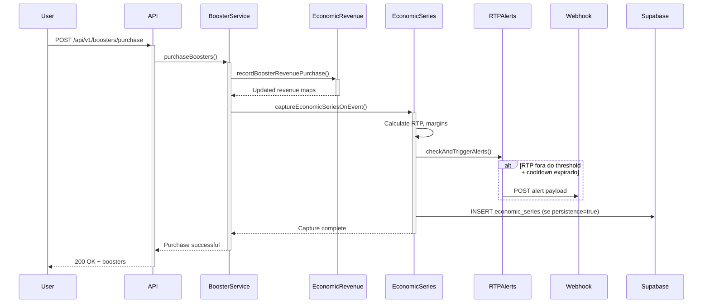
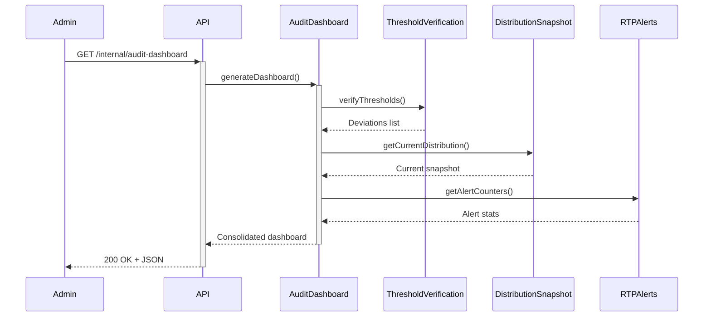

# 📊 Sistema de Observabilidade Econômica - Kroova

## Visão Geral

O sistema de observabilidade econômica do Kroova monitora em tempo real a saúde financeira do jogo, incluindo RTP (Return to Player), margens de lucro, integridade de dados e desvios de distribuição de raridade.

---

## 🎯 Componentes Principais

### 1. Economic Series (Séries Econômicas)
**Módulo:** `src/modules/observability/economicSeries.ts`

Captura longitudinal de métricas financeiras e operacionais ao longo do tempo.

#### Métricas Calculadas
```typescript
{
  timestamp: ISO8601,
  
  // Métricas Financeiras
  totalRevenue_brl: number,      // Receita total acumulada
  rtpPaid_brl: number,           // Valor pago aos jogadores
  rtpPct: number,                // RTP% = (rtpPaid / revenue) * 100
  grossMarginPct: number,        // Margem = ((revenue - rtp) / revenue) * 100
  
  // Segmentação de Receita
  revenueByType: {               // Por tipo de transação
    booster_purchase: number,
    marketplace_sale: number,
    // ... outros
  },
  revenueByChannel: {            // Por canal (moeda)
    brl: number,
    usd: number,
    pix: number
  },
  
  // Métricas de Marketplace
  marketRevenue_brl: number,     // Receita de vendas secundárias
  marketVolume: number,          // Volume de transações
  recycleRevenue_brl: number,    // Receita de reciclagem de cartas
  recycleVolume: number,         // Volume de reciclagens
  
  // Integridade (quando persistência habilitada)
  hash?: string,                 // SHA-256 do registro atual
  prev_hash?: string             // Hash do registro anterior (chain)
}
```

#### Cadência de Captura
- **Automática (eventos):** Após cada compra de booster, venda no marketplace, ou reciclagem
- **Manual:** Via endpoint `/internal/economic-series/capture` (admin apenas)
- **Agendada:** Não implementado (futuro: cron diário)

#### Persistência e Integridade
- **Ambiente de teste:** Apenas memória, sem hash chain
- **Produção:** Requer flags `ENABLE_ECONOMIC_SERIES_PERSISTENCE=true` + `ENABLE_ECONOMIC_SERIES_INTEGRITY=true`
- **Hash Chain:** Cada registro inclui hash do registro anterior, formando cadeia imutável

---

### 2. RTP Alerts (Alertas de RTP)
**Módulo:** `src/modules/observability/rtpAlerts.ts`

Monitora desvios de RTP e dispara webhooks quando limites são ultrapassados.

#### Thresholds Configurados
```typescript
const RTP_THRESHOLDS = {
  HIGH: 25,    // Acima de 25% RTP → alerta HIGH (risco de prejuízo)
  LOW: 10      // Abaixo de 10% RTP → alerta LOW (risco de retenção)
};
```

#### Cooldown de Alertas
- **Duração:** 1 hora (3600s) por tipo de alerta
- **Objetivo:** Evitar spam de webhooks durante oscilações temporárias
- **Comportamento:** Primeiro alerta é enviado imediatamente, subsequentes são suprimidos até fim do cooldown

#### Tipos de Alerta
- `RTP_HIGH`: RTP acima do limite superior (jogadores ganhando demais)
- `RTP_LOW`: RTP abaixo do limite inferior (jogadores perdendo demais)

#### Payload do Webhook
```json
{
  "alert_type": "RTP_HIGH",
  "current_rtp_pct": 27.5,
  "threshold": 25,
  "total_revenue_brl": 150000.00,
  "rtp_paid_brl": 41250.00,
  "timestamp": "2025-11-25T19:30:00Z",
  "severity": "warning",
  "message": "RTP está em 27.5%, acima do limite de 25%"
}
```

#### Configuração de Webhook
**Variável de ambiente:**
```bash
# Produção
ECONOMIC_SERIES_WEBHOOK_URL=https://hooks.slack.com/services/YOUR/WEBHOOK/URL

# Desenvolvimento (opcional - simula com RequestBin/Webhook.site)
ECONOMIC_SERIES_WEBHOOK_URL=https://webhook.site/unique-id
```

**Resolução dinâmica:**
- Se variável não definida, alerta é registrado mas webhook não é enviado
- Logs incluem tentativa de envio para debugging

---

### 3. Audit Dashboard (Painel de Auditoria)
**Endpoint:** `GET /internal/audit-dashboard`

Consolidação de múltiplas métricas de observabilidade em um único endpoint.

#### Estrutura da Resposta
```typescript
{
  // Verificação de Thresholds (distribuição de raridade)
  thresholds: {
    verified: boolean,           // Todos os thresholds dentro do esperado
    deviations: Array<{
      rarity: string,
      expected_pct: number,
      actual_pct: number,
      deviation_pct: number,
      status: 'ok' | 'warning' | 'critical'
    }>,
    last_check: ISO8601
  },
  
  // Snapshot atual de distribuição
  currentDistribution: {
    trash: number,
    meme: number,
    viral: number,
    legendary: number,
    godmode: number,
    total: number,
    timestamp: ISO8601
  },
  
  // Histórico de snapshots
  snapshots: Array<DistributionSnapshot>,
  
  // Alertas de RTP
  rtpAlerts: {
    high_count: number,          // Total de alertas HIGH disparados
    low_count: number,           // Total de alertas LOW disparados
    last_high_at?: ISO8601,      // Timestamp do último alerta HIGH
    last_low_at?: ISO8601        // Timestamp do último alerta LOW
  },
  
  // Alertas de latência (futuro)
  latencyAlerts: {
    count: number,
    last_at?: ISO8601
  },
  
  // Alertas de integridade (futuro)
  integrityAlerts: {
    count: number,
    last_at?: ISO8601
  }
}
```

#### Parâmetros de Query
- `historyLimit` (default: 10): Quantidade de registros históricos de thresholds
- `snapshotsLimit` (default: 5): Quantidade de snapshots de distribuição

#### Autenticação
- **Atual:** Sem autenticação (endpoint `/internal/*` deve ser protegido via firewall)
- **Recomendado para produção:** JWT com role `admin` ou API key dedicada

---

### 4. Economic Series Export
**Endpoint:** `GET /internal/economic-series/export`

Exporta séries econômicas com assinatura HMAC e âncora de integridade.

#### Estrutura do Bundle
```typescript
{
  series: Array<EconomicSeriesEntry>,  // Todas as entradas da série
  rtpAlerts: {
    high_count: number,
    low_count: number,
    last_high_at?: ISO8601,
    last_low_at?: ISO8601
  },
  
  // Integridade (quando habilitada)
  integrity?: {
    last_hash: string,           // Hash do último registro persistido
    hmac_signature: string,      // HMAC-SHA256 do bundle completo
    anchor_id?: string           // ID do anchor externo (blockchain/S3)
  },
  
  metadata: {
    exported_at: ISO8601,
    total_entries: number,
    date_range: {
      from: ISO8601,
      to: ISO8601
    }
  }
}
```

#### Assinatura HMAC
**Geração:**
```typescript
const payload = JSON.stringify({ series, rtpAlerts });
const signature = crypto
  .createHmac('sha256', process.env.ECONOMIC_SERIES_SECRET!)
  .update(payload)
  .digest('hex');
```

**Verificação (consumer):**
```bash
# Requer variável ECONOMIC_SERIES_SECRET idêntica
echo -n '{"series":[...],"rtpAlerts":{...}}' | \
  openssl dgst -sha256 -hmac "$ECONOMIC_SERIES_SECRET" | \
  awk '{print $2}'
```

---

## 🔧 Configuração de Ambiente

### Variáveis Obrigatórias (Produção)
```bash
# Persistência de séries econômicas (Supabase)
ENABLE_ECONOMIC_SERIES_PERSISTENCE=true

# Integridade (hash chain + HMAC)
ENABLE_ECONOMIC_SERIES_INTEGRITY=true
ECONOMIC_SERIES_SECRET=your-256-bit-secret-key-here

# Webhook de alertas RTP
ECONOMIC_SERIES_WEBHOOK_URL=https://your-slack-webhook-or-alerting-endpoint
```

### Variáveis Opcionais
```bash
# Thresholds de RTP (valores default)
RTP_ALERT_THRESHOLD_HIGH=25
RTP_ALERT_THRESHOLD_LOW=10

# Cooldown de alertas (segundos)
RTP_ALERT_COOLDOWN_SECONDS=3600

# Limites de query
ECONOMIC_SERIES_QUERY_LIMIT=100
```

---

## 📈 Fluxo de Captura de Métricas

### 1. Compra de Booster


### 2. Consulta Manual de Dashboard


---

## 🧪 Testes de Observabilidade

### Suíte de Testes Implementada
```bash
# Dashboard consolidado
tests/integration/economic_observability_dashboard.test.ts

# Pipeline completo E2E (compra → captura → alertas)
tests/integration/economicPipeline.e2e.test.ts

# Unidade: métricas financeiras
tests/unit/economicSeries.financial.test.ts

# Unidade: segmentação de receita
tests/unit/economicSeries.revenueSegmentation.test.ts

# Unidade: alertas RTP (cooldown, thresholds)
tests/unit/economicSeries.rtpAlerts.test.ts

# Integração: webhook RTP (mock HTTP)
tests/integration/economicSeries.rtpWebhook.test.ts

# Unidade: exportação com HMAC
tests/unit/economicSeries.export.test.ts
```

### Executar Testes
```bash
# Todos os testes de observabilidade
npx vitest run tests/unit/economicSeries
npx vitest run tests/integration/economic

# Suite completa (70 testes)
npx vitest run
```

---

## 🚀 Implementação em Produção

### Checklist de Deploy

#### 1. Configuração de Infraestrutura
- [ ] Criar tabela `economic_series` no Supabase (migration já existe)
- [ ] Definir `ECONOMIC_SERIES_SECRET` em secrets manager (AWS Secrets Manager, 1Password, etc)
- [ ] Configurar webhook de alertas (Slack/Discord/PagerDuty)
- [ ] Habilitar flags de persistência/integridade

#### 2. Monitoramento Inicial
- [ ] Validar primeira captura de série econômica (verificar hash chain)
- [ ] Testar disparo de alerta RTP (forçar threshold artificialmente)
- [ ] Verificar recepção de webhook (deve chegar em <5s)
- [ ] Consultar dashboard via `/internal/audit-dashboard`

#### 3. Proteção de Endpoints Internos
```nginx
# Nginx: bloquear /internal/* de IPs externos
location /internal/ {
    allow 10.0.0.0/8;         # Rede interna
    allow 172.16.0.0/12;      # VPN
    deny all;
    
    proxy_pass http://backend;
}
```

#### 4. Alerting e Escalação
```yaml
# PagerDuty/Opsgenie integration example
- name: RTP High Alert
  condition: rtpPct > 25
  severity: warning
  notify: #finance-team
  
- name: RTP Low Alert
  condition: rtpPct < 10
  severity: warning
  notify: #product-team
  
- name: Integrity Breach
  condition: hash_chain_broken
  severity: critical
  notify: #security-team
  escalate_after: 5m
```

---

## 📊 Queries Úteis (Supabase)

### RTP médio das últimas 24h
```sql
SELECT 
  AVG(rtp_pct) as avg_rtp,
  MIN(rtp_pct) as min_rtp,
  MAX(rtp_pct) as max_rtp,
  COUNT(*) as samples
FROM economic_series
WHERE timestamp > NOW() - INTERVAL '24 hours';
```

### Receita por canal (último mês)
```sql
SELECT 
  revenue_by_channel->>'brl' as brl,
  revenue_by_channel->>'usd' as usd,
  timestamp::date as day
FROM economic_series
WHERE timestamp > NOW() - INTERVAL '30 days'
ORDER BY day DESC;
```

### Verificar integridade do hash chain
```sql
WITH chain AS (
  SELECT 
    id,
    hash,
    prev_hash,
    LAG(hash) OVER (ORDER BY timestamp) as expected_prev
  FROM economic_series
  WHERE hash IS NOT NULL
  ORDER BY timestamp
)
SELECT * FROM chain
WHERE prev_hash != expected_prev
LIMIT 10;
-- Resultado vazio = chain íntegra
```

### Histórico de alertas RTP
```sql
-- Requer tabela separada de alertas (futuro enhancement)
-- Por ora, inferir via logs ou webhook delivery status
```

---

## 🔮 Roadmap Futuro

### V2 - Alertas Avançados
- [ ] Latency alerts (resposta de endpoints >2s)
- [ ] Integrity alerts (hash chain quebrada)
- [ ] Volume alerts (marketplace com volume anormal)
- [ ] Tabela dedicada `rtp_alerts` (persistir histórico)

### V3 - Visualização
- [ ] Grafana dashboard com Prometheus exporter
- [ ] Real-time streaming de métricas (WebSocket)
- [ ] Alertas configuráveis via UI admin

### V4 - Machine Learning
- [ ] Detecção de anomalias (ARIMA, Prophet)
- [ ] Predição de RTP futuro (24-72h)
- [ ] Recomendações automáticas de ajuste de thresholds

---

## 🆘 Troubleshooting

### Problema: Webhook não está sendo enviado
**Diagnóstico:**
```bash
# Verificar variável de ambiente
echo $ECONOMIC_SERIES_WEBHOOK_URL

# Verificar logs do servidor
grep "Sending RTP alert webhook" logs/app.log
```
**Solução:**
- Garantir que `ECONOMIC_SERIES_WEBHOOK_URL` está definida
- Testar webhook manualmente: `curl -X POST -d '{"test":true}' $ECONOMIC_SERIES_WEBHOOK_URL`

### Problema: Hash chain quebrada
**Diagnóstico:**
```sql
-- Query acima de verificação de integridade
```
**Possíveis causas:**
- Migração de dados sem recalcular hashes
- Backup/restore sem preservar ordem de timestamp
- Bug em captureInternal (reportar imediatamente)

**Solução:**
```bash
# Recomputar hash chain (script admin)
node scripts/recompute_economic_series_hashes.js --from 2025-11-01
```

### Problema: RTP sempre acima de threshold
**Diagnóstico:**
- Analisar distribuição de valores de carta vs custo de booster
- Verificar se jackpot está disparando com muita frequência

**Solução:**
- Ajustar `RTP_ALERT_THRESHOLD_HIGH` temporariamente
- Revisar economia de edição (ver `KROUVA_BOOSTER_ALGORITHM.md`)

---

## 📚 Referências

- [KROUVA_BOOSTER_ALGORITHM.md](./KROUVA_BOOSTER_ALGORITHM.md) - Algoritmo de distribuição e RTP
- [KROUVA_DB_SCHEMA.md](./KROUVA_DB_SCHEMA.md) - Schema da tabela `economic_series`
- [KROUVA_SECURITY_AND_ANTIFRAUD.md](./KROUVA_SECURITY_AND_ANTIFRAUD.md) - Proteção de endpoints internos

---

**Última atualização:** 2025-11-25  
**Versão:** 1.0  
**Responsável:** Engineering Team
